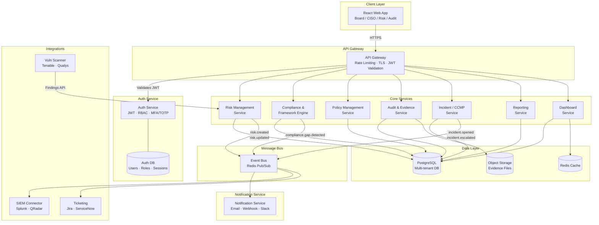

# Enterprise GRC Platform — System Architecture

## Overview

A multi-tenant, microservices-based Enterprise Cyber Risk Governance & Compliance (GRC) Platform supporting ISO 27001, SOC 2, PCI DSS, NIST CSF, HIPAA, and GDPR.

---

## Architecture Diagram



---

## Service Responsibilities

### 1. API Gateway
- TLS termination, rate limiting (100 req/min per tenant)
- JWT validation and forwarding `X-Tenant-ID`, `X-User-ID`, `X-Roles` headers
- Request/response logging, CORS enforcement

### 2. Auth Service
- User registration, login, logout
- JWT access tokens (15min TTL) + refresh tokens (7d TTL)
- TOTP-based MFA (RFC 6238) using `speakeasy`
- RBAC: roles `super_admin`, `admin`, `ciso`, `risk_manager`, `auditor`, `viewer`
- Password hashing (bcrypt, 12 rounds)
- Session management, token revocation

### 3. Risk Management Service
- Risk register CRUD (assets, threats, vulnerabilities, likelihood, impact)
- Risk scoring engine: `Inherent Risk = Likelihood × Impact`; `Residual Risk = Inherent × (1 - Control Effectiveness)`
- Control linkage (many-to-many)
- Risk acceptance, treatment plans
- KRI monitoring and threshold alerting

### 4. Compliance & Framework Mapping Engine
- Framework management (ISO 27001, SOC 2, PCI DSS, NIST CSF, HIPAA, GDPR)
- Control-to-framework requirement mapping (many-to-many)
- Auto gap analysis: identifies unmapped/non-compliant controls
- Compliance score calculation per framework
- Cross-framework control reuse detection

### 5. Policy Management Service
- Policy lifecycle: Draft → Review → Approved → Published → Retired
- Version control with diff tracking
- Policy-to-control mapping
- Acknowledgement tracking (who signed what policy, when)
- Review schedule and expiry alerts

### 6. Audit & Evidence Service
- Audit plan creation and scheduling
- Finding management (Minor / Major / Critical)
- Corrective Action Plan (CAP) tracking
- Evidence metadata repository (linked to S3/object storage)
- Evidence-to-control/requirement mapping
- Chain of custody logging

### 7. Incident / CCMP Service
- Incident lifecycle: Detected → Triaged → Contained → Eradicated → Recovered → Closed
- Severity classification (P1–P4)
- Cyber Crisis Management Plan (CCMP) workflows
- Timeline and response log
- Stakeholder notification triggers
- Post-incident review (PIR)

### 8. Reporting Service
- Board-level summary (PDF/Excel)
- Framework compliance reports
- Risk trend analysis
- KPI/KRI dashboards

### 9. Notification Service
- Email (SMTP), Slack webhook, MS Teams webhook
- Event-driven: subscribes to message queue
- Configurable escalation rules

---

## Communication Patterns

| Pattern | Used For |
|---------|----------|
| REST (sync) | All client-facing CRUD operations |
| Redis Pub/Sub (async) | Cross-service events (risk changes, incidents, alerts) |
| Database (shared) | Single PostgreSQL instance with tenant isolation via `org_id` |

---

## Multi-Tenancy Model

- **Tenant isolation**: Row-level security (RLS) in PostgreSQL via `org_id` on every table
- **Tenant context**: Extracted from JWT claim `org_id`, injected into every query
- **Data separation**: No cross-tenant data leakage by design

---

## Security Architecture

```
[Client] --TLS 1.3--> [Gateway] --mTLS--> [Services]
                           |
                    [JWT Validation]
                    [Rate Limiting]
                    [Input Sanitization]
                           |
                    [RBAC Middleware]
                           |
                    [Audit Log] --> [Immutable Audit Trail]
```

- Data at rest: PostgreSQL `pgcrypto` encryption for PII fields
- Data in transit: TLS 1.3 enforced
- Secrets: Environment variables, never in code
- All mutations logged to `audit_logs` table (immutable, append-only)
